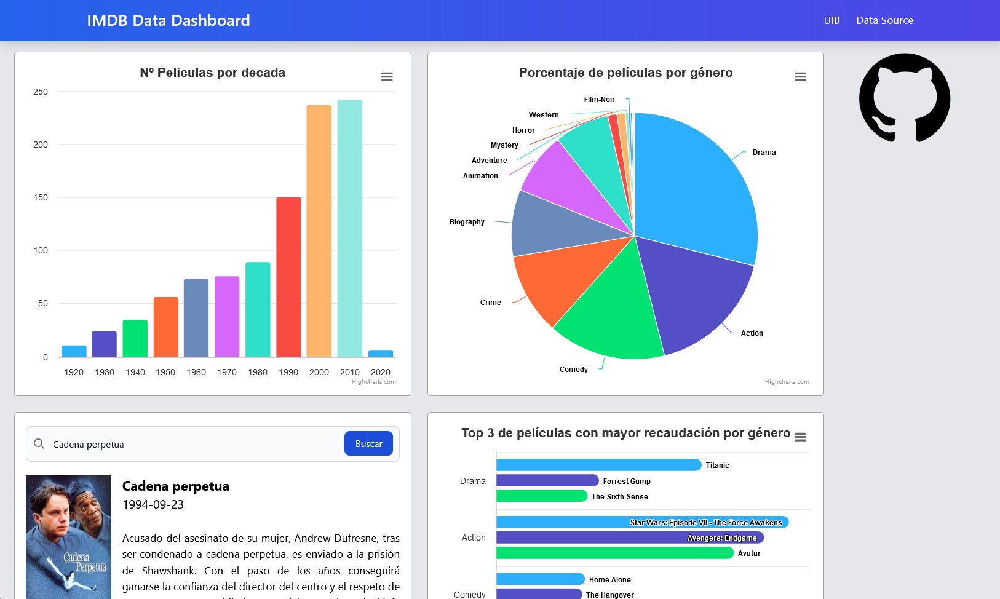

# IMDB Data Dashboard

#### Autores: Ramiro Martins y Albert Salom

Este proyecto es un dashboard interactivo diseñado para visualizar y analizar datos de películas del conjunto de datos de IMDb Top 1000. Incluye gráficos dinámicos, búsquedas de películas específicas a través de la API de TMDB, vídeo destacado de una crítica de una película y visualizaciones generadas a partir de datos almacenados en una base de datos MySQL.

## Setup

Para hacer poder interactuar con la página web, deberá descargar el repositorio e introducirlo en la carpeta _/htdocs_ de xampp. Además deberá importar la base de datos a partir del archivo sql.

## Data Set

El dataset de IMDb Top 1000 contiene información sobre las 1000 películas mejor valoradas según [IMDb](https://www.imdb.com/). A partir de la base de datos, utilizamos estas variables:

- **_Series_Title_**: Nombre de la película.
- **_Released_Year_**: Año de lanzamiento.
- **_Genre_**: Género/s de la película.
- **_Gross_**: Recaudación de la película en dólares.

La base de datos se encuentra hospedado en un servidor MySQL en local.

## Integraciones

- **_TailwindCSS_**: **Framework de CSS** para el diseño del layout. Hemos decidido utilizar este framework porque estamos más familiarizados con él y creemos que ofrece menos limitaciones en cuanto a personalización.

- **_Highcharts_**: Librería de gráficos interactivos utilizado en el proyecto. Dentro de _Highcharts_, hemos utilizado el _Bar_Chart_, _Pie_Chart_ y _Column_Chart_.

- **_The Movie Database (TMDB) API_**: API utilizada para buscar información de películas específicas en tiempo real. La búsqueda se puede realizar tanto con el id de IMDb como con el nombre de la película, ya sea en inglés o en español.

## Gráficos Interactivos

En cuánto a los gráficos interactivos, hemos implementado tres tipos de gráficos:

1. **Películas por década**: Muestra un gráfico de columnas con el número de películas lanzadas en cada década. Como se puede observar en el gráfico, la década de los 2020 es la que menos películas tiene, ya que aún no ha terminado.

2. **Distribución por géneros**: Representa un gráfico de pastel con los géneros principales de las películas y su porcentaje. Para ello, hemos extraído el primer género de cada película y los hemos ordenado de mayor a menor.

3. **Recaudación por año**: Muestra un gráfico de barras con las top 3 películas más taquilleras de los 5 géneros más comunes en la lista.

## Uso de la API de TMDB

A partir de una pequeña barra de búsqueda, podemos obtener información de cualquier película. Para ello, hay que introducir el nombre de la película en inglés o en español. La API de TMDB nos devuelve la información de la película y nosotros mostramos el poster, el título, la fecha de lanzamiento y la sinopsis.

## Estructura del Proyecto

### Frontend

**HTML**: Contiene la estructura básica del dashboard con secciones para los gráficos, el formulario de búsqueda y los resultados.

**JavaScript:**

- _api.js_: Encargado de hacer la gestión con la API de TMDB.
- _Chart.js_: Se encarga de gestionar las solicitudes y salidas del php y genera los gráficos a partir de los datos obtenidos.

### Backend

**PHP**:

- _database.php_: Encargado de establecer conexión con la base de datos y procesar las consultas SQL para generar los datos de los gráficos en formato _JSON_ y enviarlos al frontend.

**SQL**:

Contiene todos los datos para la creación de la base de datos y la inserción de los datos del dataset.

## Accesibilidad

Nuestro proyecto sigue las pautas de accesibilidad WAI-AA para asegurar que sea accesible para la mayoría de los usuarios, incluyendo aquellos con discapacidades. Hemos implementado varias medidas para cumplir con estas pautas y proporcionar una experiencia inclusiva para todos los usuarios.

Algunas de las medidas que hemos implementado incluyen:

- **Etiquetas ARIA**: Hemos añadido etiquetas ARIA a los elementos interactivos para mejorar la navegación y comprensión del contenido para usuarios de lectores de pantalla.
- **Contraste de colores**: Nos hemos asegurado de que el contraste de colores entre el texto y el fondo sea suficiente para ser legible para usuarios con baja visión.
- **Navegación por teclado**: Todos los elementos interactivos pueden ser accedidos y utilizados mediante el teclado, facilitando la navegación para usuarios que no pueden usar un ratón.
- **Tamaños de fuente ajustables**: Los usuarios pueden ajustar el tamaño de la fuente utilizando los controles de tamaño de texto proporcionados en la interfaz.
- **Descripciones de gráficos**: Cada gráfico incluye una descripción accesible que explica su contenido y propósito, asegurando que la información visual también sea accesible para usuarios con discapacidades visuales.
- **Formularios accesibles**: Los formularios de búsqueda y otros elementos interactivos están diseñados para ser accesibles, con etiquetas claras y descripciones que facilitan su uso.

Estas medidas nos ayudan a cumplir con las pautas de accesibilidad WAI-AA y a proporcionar una experiencia inclusiva para todos los usuarios.

## Créditos

Framework CSS: [TailwindCSS](https://tailwindcss.com/)

Gráficos: [Highcharts](https://www.highcharts.com/)

Fuente de Datos: [IMDB Dataset](https://www.kaggle.com/datasets/harshitshankhdhar/imdb-dataset-of-top-1000-movies-and-tv-shows)

API de Búsqueda: [The Movie Database](https://www.themoviedb.org/)
